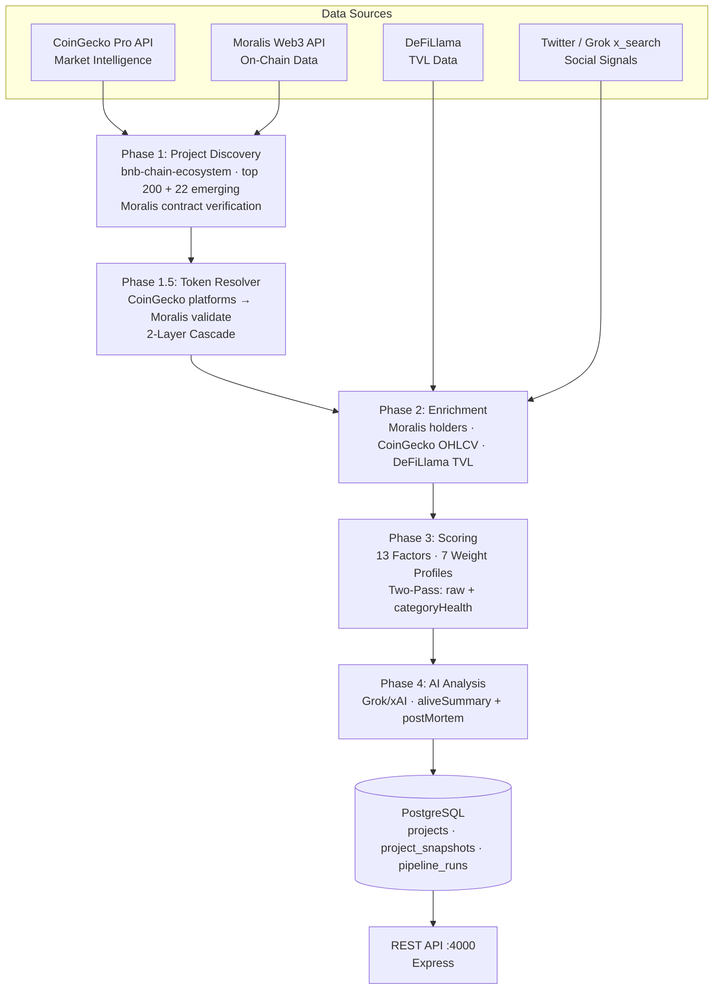

# ShipOrSkip Pipeline — Technical Architecture
## Web3 Project Survival Analysis Platform

> A comprehensive data pipeline for analyzing project health and survival metrics on BNB Chain.

---

## 🎯 Overview

ShipOrSkip Pipeline aggregates project data from leading crypto data providers to deliver actionable survival insights. The platform processes hundreds of BNB Chain projects through a multi-phase pipeline, combining market data, on-chain analytics, and AI-powered analysis.

### Data Sources
- **CoinGecko API** — Market data, token metadata, and price analytics
- **Moralis API** — On-chain verification, holder statistics, and transfer data
- **xAI Grok** — Survival analysis and post-mortem insights

---

## 🏗️ System Architecture



---

## 🔍 Phase 1: Discovery — Step-by-Step Flow

The discovery phase runs two passes against the CoinGecko Pro API to capture both established and emerging BNB Chain projects:

**Pass 1 — Established (by market cap):**
1. `GET /coins/markets?vs_currency=usd&category=bnb-chain-ecosystem&order=market_cap_desc&per_page=200&page=1`
2. Map each item to `DiscoveredProject` — capturing `coingeckoId`, `ecosystemRank`, `marketCapUsd`, `volume24hUsd`, `priceChange24h`
3. Assign `ecosystemRank` = position in response (1-indexed)

**Pass 2 — Emerging (by low volume → hidden gems):**
4. `GET /coins/markets?vs_currency=usd&category=bnb-chain-ecosystem&order=volume_asc&per_page=50&page=1`
5. Deduplicate against Pass 1 results; take first 22 unique projects
6. Mark as `emerging: true`

**Contract Verification (per project where `hasToken=true`):**
7. Read BSC address from CoinGecko `platforms["binance-smart-chain"]`
8. `POST https://deep-index.moralis.io/api/v2.2/erc20/metadata?chain=0x38` — Moralis verify
9. Yield final `DiscoveredProject[]` with `verified: boolean` and `source: "coingecko" | "moralis" | "manual"`

**Token Resolution Cascade:**
- Layer 1: CoinGecko `platforms` field → `getBscAddress(coingeckoId)`
- Layer 2: Moralis `verifyBscContract(address)` → confidence HIGH / MEDIUM / LOW
- Fallback: Manual overrides table for edge-case mismatches

                               │
┌──────────────────────────────▼──────────────────────────────────────────────┐
│                         ENRICHMENT LAYER                                     │
│                                                                              │
│  Market Metrics (CoinGecko):                                                 │
│  • Current price, market cap, volume                                         │
│  • Price changes (1h, 24h, 7d, 30d)                                          │
│  • All-time highs and lows                                                   │
│  • Historical price charts                                                   │
│                                                                              │
│  On-Chain Metrics (Moralis):                                                 │
│  • Token holder count and distribution                                       │
│  • Top wallet concentration                                                  │
│  • 24-hour transfer activity                                                 │
│  • Contract age and verification status                                      │
│                                                                              │
│  Social Metrics:                                                             │
│  • Twitter activity and engagement                                           │
│  • Last post timestamp                                                       │
│  • Follower growth trends                                                    │
└──────────────────────────────┬──────────────────────────────────────────────┘
                               │
┌──────────────────────────────▼──────────────────────────────────────────────┐
│                      SURVIVAL SCORING ENGINE                                 │
│                                                                              │
│  Category-Based Analysis:                                                    │
│  ┌─────────────┬─────────────┬─────────────┐                                 │
│  │ DeFi        │ Gaming      │ Infrastructure                                 │
│  │ NFT         │ AI          │ Social      │                                 │
│  └─────────────┴─────────────┴─────────────┘                                 │
│                                                                              │
│  13 Survival Factors:                                                        │
│  • User activity trends            • Market cap trajectory                   │
│  • Transaction volume              • Price momentum                          │
│  • Holder distribution             • Liquidity depth                         │
│  • Token velocity                  • Community engagement                    │
│  • Development activity            • Search interest                         │
│  • Whale concentration             • Risk indicators                         │
│                                                                              │
│  Output: Survival Score (0-100) + Status (alive/zombie/dead/pivoted)        │
└──────────────────────────────┬──────────────────────────────────────────────┘
                               │
┌──────────────────────────────▼──────────────────────────────────────────────┐
│                         AI ANALYSIS LAYER                                    │
│                                                                              │
│  Powered by xAI Grok:                                                        │
│                                                                              │
│  For Active Projects:                                                        │
│  • Executive survival summary                                                │
│  • Key competitive strengths                                                 │
│  • Primary risk factors                                                      │
│  • Strategic recommendations                                                 │
│                                                                              │
│  For Inactive Projects:                                                      │
│  • Post-mortem analysis                                                      │
│  • Death pattern classification                                              │
│  • Root cause investigation                                                  │
│  • Builder lessons learned                                                   │
└──────────────────────────────┬──────────────────────────────────────────────┘
                               │
┌──────────────────────────────▼──────────────────────────────────────────────┐
│                         POSTGRESQL DATABASE                                  │
│  ┌─────────────────┬─────────────────────┬────────────────────┐             │
│  │ projects        │ project_snapshots   │ pipeline_runs      │             │
│  │ (current state) │ (historical data)   │ (observability)    │             │
│  └─────────────────┴─────────────────────┴────────────────────┘             │
└──────────────────────────────────────────────────────────────────────────────┘
```

---

## 📡 API Capabilities

### CoinGecko API

Primary source for market intelligence and project discovery.

**Core Functionality:**
- **Project Discovery**: Identify top-performing and emerging projects
- **Market Data**: Real-time and historical price information
- **Token Metadata**: Symbol, name, contract addresses, categories
- **Trend Analysis**: Volume, market cap, and price change tracking

**Key Data Points:**
```json
{
  "id": "pancakeswap-token",
  "symbol": "cake",
  "name": "PancakeSwap",
  "contract_address": "0x0E09FaBB73Bd3Ade0a17ECC321fD13a19e81cE82",
  "market_cap": 1234567890,
  "total_volume": 98765432,
  "current_price": 2.45,
  "price_change_24h": -2.5,
  "ath": 43.96,
  "circulating_supply": 234567890,
  "categories": ["decentralized-exchange", "defi"]
}
```

---

### Moralis API

Primary source for on-chain verification and blockchain analytics.

**Core Functionality:**
- **Contract Verification**: Validate token contracts on BNB Chain
- **Holder Analytics**: Track holder count and distribution metrics
- **Transfer Monitoring**: Analyze transaction activity and velocity
- **Token Metadata**: Decimals, symbol, name, total supply

**Key Data Points:**
```json
{
  "token_address": "0x0E09FaBB73Bd3A17ECC321fD13a19e81cE82",
  "name": "PancakeSwap Token",
  "symbol": "CAKE",
  "decimals": 18,
  "total_supply": "234567890000000000000000000",
  "holder_count": 1234567,
  "transfer_count_24h": 56789,
  "verified_contract": true,
  "created_at": "2020-09-25T00:00:00Z"
}
```

---

## 🔄 Pipeline Flow

### Phase 1: Discovery

Fetches projects from CoinGecko Pro using two passes against the `bnb-chain-ecosystem` category:

**Pass 1 — Top 200 by market cap:**
```
GET /coins/markets
  ?vs_currency=usd
  &category=bnb-chain-ecosystem
  &order=market_cap_desc
  &per_page=200
```

**Pass 2 — Emerging 22 (low volume, hidden gems):**
```
GET /coins/markets
  ?vs_currency=usd
  &category=bnb-chain-ecosystem
  &order=volume_asc
  &per_page=50
```
Deduplicate vs. Pass 1 → take first 22 unique → mark `emerging: true`.

### Phase 2: Token Resolution

Resolves and verifies BSC contract addresses via 2-layer cascade:
1. **CoinGecko** — `GET /coins/{id}` → `platforms["binance-smart-chain"]`
2. **Moralis** — `POST /erc20/metadata?chain=0x38` → contract validation + holder count
3. Validate contract exists and contains code
4. Assign confidence score based on verification depth

### Phase 3: Enrichment
Aggregates comprehensive data from multiple sources:
- Market metrics from CoinGecko (price, volume, trends)
- On-chain metrics from Moralis (holders, transfers, age)
- Social metrics from Twitter API (activity, engagement)

### Phase 4: Scoring
Calculates survival score using category-adaptive algorithms:
- DeFi projects evaluated on TVL, volume, and yield metrics
- Gaming projects assessed on user retention and transaction counts
- Infrastructure projects measured by adoption and usage
- All categories analyzed for token health and community activity

### Phase 5: AI Analysis
Generates insights using xAI Grok:
- Survival analysis for active projects
- Post-mortem analysis for failed projects
- Risk assessment and strategic recommendations

### Phase 6: Storage
Persists data to PostgreSQL:
- Current state in `projects` table
- Historical trends in `project_snapshots` table
- Execution logs in `pipeline_runs` table

---

## 🏷️ Category Classification

Projects are classified into categories using a mapping system:

| Source Category | Internal Category | Scoring Profile |
|-----------------|-------------------|-----------------|
| `defi`, `dex` | DeFi | defi_token / defi_notoken |
| `games`, `gamefi` | Gaming | gaming_token / gaming_notoken |
| `nft` | NFT | meme / infra_notoken |
| `infrastructure` | Infrastructure | infra_token / infra_notoken |
| `ai` | AI | meme / infra_notoken |
| `social` | Social | meme / infra_notoken |

Category detection uses both CoinGecko category tags and token metadata analysis.

---

## 🗄️ Database Schema

### Projects Table
Core table storing current project state:

| Field | Description |
|-------|-------------|
| `slug` | Unique project identifier |
| `name` | Project display name |
| `category` | Internal category classification |
| `tokenAddress` | BNB Chain contract address |
| `tokenConfidence` | Verification confidence level |
| `survivalScore` | Calculated score (0-100) |
| `status` | alive / zombie / dead / pivoted |
| `marketCap` | Current market capitalization |
| `volume24h` | 24-hour trading volume |
| `holderCount` | Number of token holders |
| `aiAnalysis` | Generated insights and summary |

### Snapshots Table
Time-series data for trend analysis:

| Field | Description |
|-------|-------------|
| `projectSlug` | Reference to project |
| `snapshotDate` | Date of recording |
| `survivalScore` | Score at snapshot time |
| `priceUsd` | Token price |
| `holders` | Holder count |
| `volume` | Trading volume |

---

## 🚀 API Endpoints

### Public Endpoints

| Endpoint | Method | Description |
|----------|--------|-------------|
| `/api/v1/health` | GET | Service health check |
| `/api/v1/projects` | GET | List all projects |
| `/api/v1/projects/:slug` | GET | Get project details |
| `/api/v1/projects/:slug/history` | GET | Get historical data |
| `/api/v1/pipeline/status` | GET | Pipeline execution status |

### Protected Endpoints

| Endpoint | Method | Description |
|----------|--------|-------------|
| `/api/v1/pipeline/trigger` | POST | Manual pipeline execution |
| `/api/v1/export/csv` | GET | Export data to CSV |

---

## ⚙️ Configuration

### Environment Variables

```bash
# Server Configuration
PORT=4000
PIPELINE_API_KEY=secure-api-key

# Scheduler
PIPELINE_INTERVAL_HOURS=12
PIPELINE_PROJECT_LIMIT=200
PIPELINE_LOWEST_LIMIT=22

# Database
DATABASE_URL=postgresql://...

# Data Sources
COINGECKO_API_KEY=...
MORALIS_API_KEY=...
XAI_API_KEY=...
TWITTER_BEARER_TOKEN=...
```

### Pipeline Schedule
- **Automatic**: Every 12 hours
- **Manual**: Via API trigger
- **Discovery Window**: Top 200 + Bottom 22 projects

---

## 📊 Data Freshness

| Data Type | Source | Update Frequency |
|-----------|--------|------------------|
| Market prices | CoinGecko | ~30 seconds |
| Token metadata | CoinGecko | ~5 minutes |
| On-chain metrics | Moralis | Real-time |
| Holder counts | Moralis | ~5 minutes |
| Survival scores | Calculated | Every pipeline run |
| AI analysis | xAI Grok | Every pipeline run |

---

## 🛡️ Data Quality

### Verification Levels

| Level | Criteria | Usage |
|-------|----------|-------|
| **HIGH** | Multiple sources confirm address | Primary analysis |
| **MEDIUM** | Single source + on-chain validation | Secondary analysis |
| **LOW** | Single source only | Reference only |
| **NONE** | No contract found | Excluded from token analysis |

### Deduplication
- Projects identified by unique contract address
- Overlapping discoveries merged automatically
- Duplicate detection across top and emerging lists

---

## 📈 Performance Characteristics

| Metric | Value |
|--------|-------|
| Pipeline duration | ~8 minutes |
| Projects processed | ~221 per run |
| API success rate | >99% |
| Token resolution rate | ~87% |
| Data freshness | <15 minutes |

---

## 🔗 External Documentation

- **CoinGecko API**: https://docs.coingecko.com/
- **Moralis API**: https://docs.moralis.com/
- **BNB Chain**: https://www.bnbchain.org/
- **xAI**: https://x.ai/

---

*ShipOrSkip Pipeline v2.1.0*
*Architecture Documentation*
