# Project: Problem, Solution & Impact

> **ShipOrSkip** — BNB Ecosystem Intelligence for Builders

---

## 1. Problem

Builders in the BNB ecosystem launch blind. They don't know:

- **What similar projects already exist** — and whether they survived or died
- **Why projects fail** — the specific patterns that kill 60%+ of BSC projects
- **Where the ecosystem narrative is moving** — which categories are rising, which are dying
- **Whether their idea has product-market fit** — or if they're repeating a failed pattern

The result: thousands of projects launch, most die, and builders repeat the same mistakes.

### The Vibecoding Paradox

The rise of vibecoding tools (Cursor, Windsurf, v0, Lovable, Replit, Base44) has made **building** easier than ever. Anyone can ship a project in hours. But none of these tools answer:

- *"What happened when others built THIS?"*
- *"Has someone already tried and failed?"*
- *"What's the ecosystem telling us about this category?"*

**More vibecoding tools → More projects launched → MORE projects fail → MORE need for pre-build intelligence.**

Vibecoding accelerates building. Without an intelligence layer, it just accelerates failure.

```mermaid
flowchart LR
    A[Builder has idea] --> B{ShipOrSkip?}
    B -->|Without| C[Open Cursor → Build 2hr → Launch → Die → Repeat]
    B -->|With| D[Validate → PMF Score 72 → 3 similar dead projects found]
    D --> E[Adjust approach → Build informed → Higher survival rate]
```



---

## 2. Solution

**ShipOrSkip** is a curated BNB ecosystem intelligence platform with four core modules:

### 🔎 Ecosystem Radar
An automated data pipeline (**Pipeline v2**) continuously discovers, enriches, and scores BNB Chain projects from leading BNB Chain data APIs — aggregating 200+ projects by on-chain activity. Projects are scored 0-100 using a **13-factor, category-adaptive survival model** running on a VPS with PostgreSQL storage. The frontend fetches live data via ISR (10-minute cache), with local JSON fallback for resilience.

### 💀 Post-Mortem Reports
For dead/zombie projects: *what happened, why it died, the timeline, root cause, and lessons for builders*. AI-generated by Grok/xAI from real multi-source data.

### 📡 Narrative Radar
Ecosystem narrative trends from social signals — which categories are rising vs declining. Helps builders time their entry (Grok x_search via Twitter when enabled).

### ✅ Idea Validator
Builder pastes their idea → system matches against **live project database** → Grok `grok-4-1-fast-reasoning` analyzes similar projects, death patterns, and narrative timing → returns **PMF score + actionable recommendation**. Ecosystem statistics in the Grok prompt are sourced from the live VPS pipeline, refreshed every 10 minutes. Protected by Cloudflare Turnstile CAPTCHA.

**No wallet required** for any of the above. Zero friction for judges and users.

### What makes it different

| Platform | Question Answered |
|----------|-------------------|
| Cursor / Windsurf | "How to code this?" |
| v0 / Lovable | "How to design this?" |
| Replit / Base44 | "How to deploy this?" |
| **ShipOrSkip** | **"What happened when others built THIS?"** |

ShipOrSkip is **Step 0** — the intelligence layer before you open any coding tool.

---

## 3. Business & Ecosystem Impact

### Target Users

| Segment | Use Case | Value |
|---------|----------|-------|
| **Builders/Founders** (primary) | Validate idea before building | Avoid repeating proven failure patterns |
| **Existing Project Teams** (secondary) | Read market direction, prioritize features | Data-driven pivots |
| **Investors** (tertiary) | Landscape overview before investing | Portfolio intelligence |

### Ecosystem Value

- **For BNB Chain:** Reduces project failure rate → healthier ecosystem, better reputation
- **For builders:** Saves weeks/months of building something doomed to fail
- **For the community:** Transparent, data-driven project health scores — reduces information asymmetry

### Data Moat & Network Effect

```
More projects tracked → Better pattern matching → More accurate predictions
→ More builders trust ShipOrSkip → More ideas validated
→ More validation data → Even better pattern matching
→ ShipOrSkip becomes THE pre-build intelligence standard
```

Every post-mortem report = content marketing built-in. Every dead project = a lesson that's viral-worthy. **Data IS the distribution strategy.**

### Onchain Composability

The `ShipOrSkipScoreboard` smart contract stores survival scores onchain. Any other dApp can:
- Query a project's survival score before integrating
- Use scores as input for DeFi risk parameters
- Build on top of ShipOrSkip's intelligence layer

Current onchain proof (BSC Mainnet):
- Contract: `0xd6a229D8cFbde4be596dd9Cd53d1b3E8bD272432`
- Explorer: https://bscscan.com/address/0xd6a229D8cFbde4be596dd9Cd53d1b3E8bD272432
- Proof tx: `0x4afe87ab4df35e14ca0f91adaac35061b31d8da438dd9b66c8468a1f18deef58`
- Tx link: https://bscscan.com/tx/0x4afe87ab4df35e14ca0f91adaac35061b31d8da438dd9b66c8468a1f18deef58

---

## 4. Limitations & Future Work

### Current Limitations (Hackathon Version)

| Limitation | Impact | Mitigation |
|------------|--------|------------|
| Token resolution for projects with long names | Some gaming/AI tokens not yet mapped (e.g. "SERAPH In The Darkness") | 3-pass CoinGecko search + manual override table added |
| Pipeline processes top 30 projects per run | Not full 200+ yet | Limit configurable; runs every 12h automatically |
| Social data availability | Some dead project accounts deleted | NodeReal/BSCScan on-chain signals still available |
| AI hallucination risk | LLM may generate incorrect analysis | Rule-based 13-factor scoring as primary; AI narrative as supplement |
| No user accounts | Can't save validation history across devices | localStorage for MVP; accounts post-hackathon |

### Roadmap

**Short-term (Post-Hackathon):**
- Real-time data pipeline (auto-refresh every 24h)
- Provider abstraction layer for multiple sources (Dapp directory + Moralis + RootData)
- Expand to 200+ BSC projects
- User accounts + validation history sync
- API access for other builders

**Long-term (SaaS Vision):**

| Tier | Price | Features |
|------|-------|----------|
| Free | $0 | Browse top 50 projects, basic survival scores |
| Builder | $29/mo | Full database, idea validator, narrative trends, weekly reports |
| Investor | $99/mo | Advanced analytics, portfolio tracking, alpha signals, API access |
| Enterprise | Custom | Custom ecosystem research, white-label reports |

### Open Questions

- Can survival scoring predict future success with >70% accuracy?
- What's the optimal feedback loop between user validations and score improvements?
- How to expand beyond BNB Chain while maintaining data quality?
