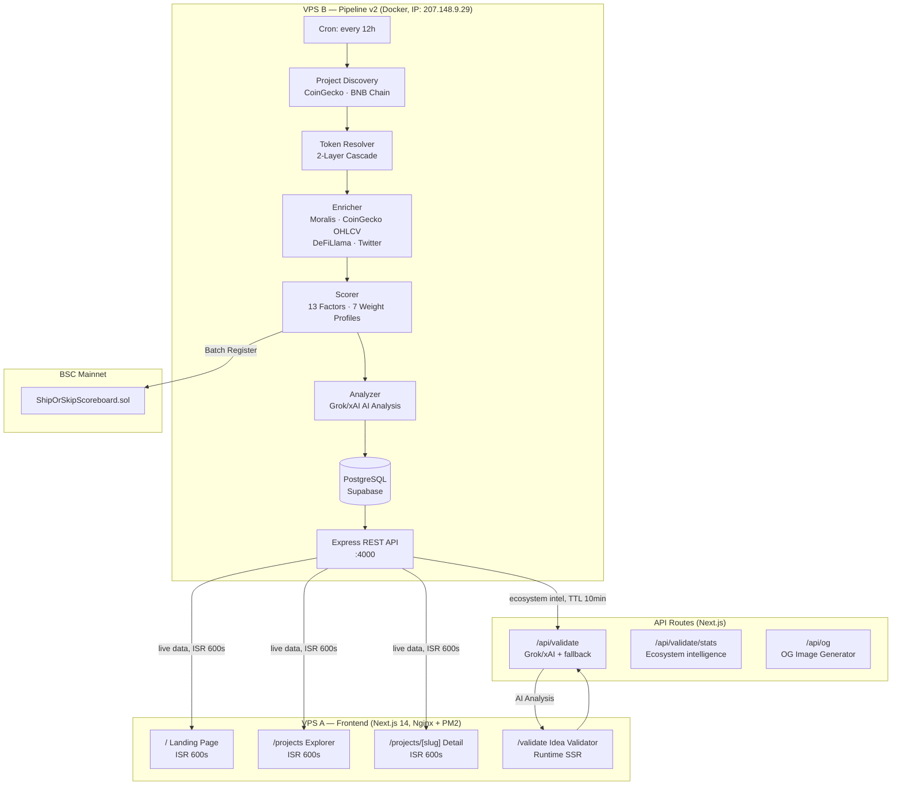
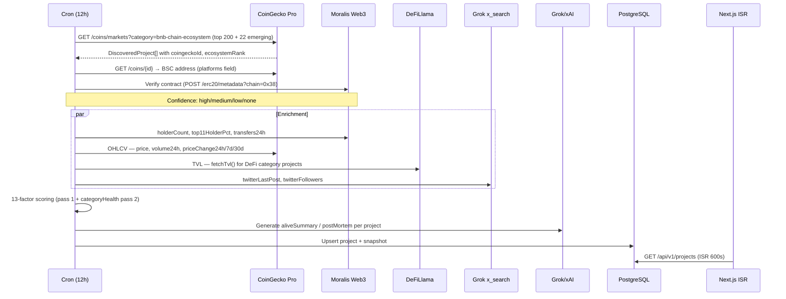
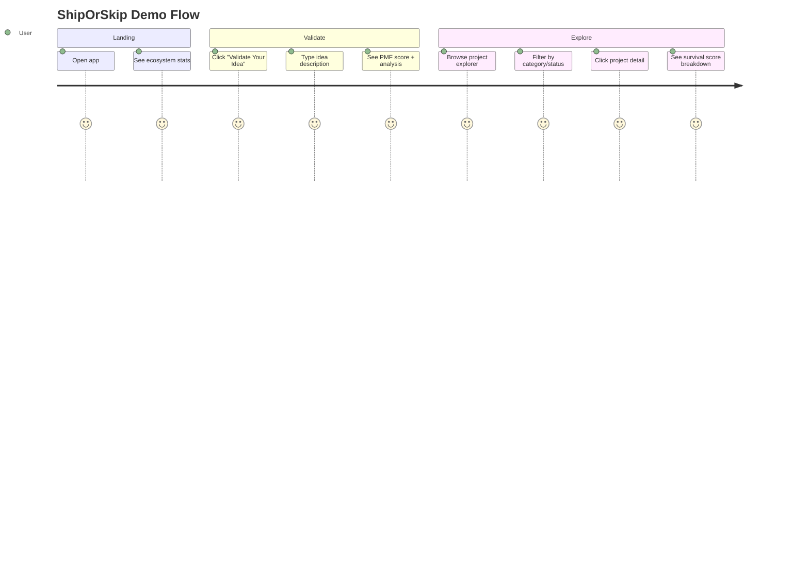

# Technical: Architecture, Setup & Demo

> **ShipOrSkip** — How it works under the hood

---

## 1. Architecture

### System Overview

ShipOrSkip adalah **platform intelijen data dua-tier** yang berjalan di **dua VPS terpisah**:

1. **Pipeline v2 (VPS B)** — autonomous data pipeline (Vultr, Node.js + Docker + PostgreSQL). Discovers, enriches, scores, dan AI-analyzes BNB Chain projects. Exposes REST API di port 4000. Runs setiap 12 jam otomatis. IP: `207.148.9.29`.
2. **Frontend (VPS A)** — Next.js 14 (App Router) dengan ISR (10-minute cache). Fetches live data dari Pipeline v2 API, falls back ke local `data/projects.json` jika API tidak tersedia. Domain: `shiporskip.xyz`.

> **Kenapa dipisah?** Pipeline spike CPU/memory setiap 12 jam (3-5 menit enrichment + AI analysis). Dengan VPS terpisah, spike ini tidak berdampak pada response time frontend dan `/api/validate` yang membutuhkan 60-90s untuk Grok reasoning.

For validator inference, runtime mode is hybrid:
- Primary verdict: Grok `grok-4-1-fast-reasoning` (`XAI_API_KEY`) — fast reasoning model for PMF scoring
- Primary intel: Grok `grok-4-1-fast-non-reasoning` (`XAI_API_KEY`) — Twitter/X trends via `x_search`
- Reddit intel: Kimi K2.5 (`KIMI_API_KEY`) — community discussions via `$web_search` (30s timeout, non-blocking)
- Fallback: data-driven path when AI unavailable
- Anti-spam: Cloudflare Turnstile CAPTCHA on validator form
- Ecosystem statistics in prompts sourced from live Pipeline v2 API (TTL-cached, 10 min)
- **Deployment:** VPS (Nginx + PM2) — required for 90s AI timeout support (see [DEPLOY_FRONTEND_VPS.md](./DEPLOY_FRONTEND_VPS.md))



### Components

| Component | Technology | Role |
|-----------|------------|------|
| **Pipeline v2** | Node.js 20 + TypeScript, Docker, Express, node-cron | Autonomous pipeline: discovery → resolution → enrichment → scoring → AI analysis → store |
| **Database** | PostgreSQL (Supabase + PgBouncer) + Prisma v5 ORM | Persistent project storage with historical snapshots |
| **Frontend** | Next.js 14 (App Router), Tailwind CSS v4, TypeScript | 4 pages: Landing, Explorer, Detail, Validator |
| **API Routes** | Next.js Server Routes | `/api/validate` (Grok primary verdict + fallback), `/api/og` (OG images), `/api/validate/stats` |
| **Scoring Engine** | TypeScript (pipeline-v2) | 13-factor, category-adaptive survival scoring (0-100) |
| **Smart Contract** | Solidity + Hardhat | Public scoreboard on BSC Mainnet |

### Database Schema (Prisma)

The frontend uses **Supabase PostgreSQL** via Prisma ORM for persisting anonymous validation records. This powers community aggregate stats ("247 ideas validated, DEX ideas avg PMF 38/100").

```prisma
model ValidationRecord {
  id               Int      @id @default(autoincrement())
  category         String                          // e.g. "DEX", "Gaming", "AI"
  signal           String                          // SHIP | SHIP_WITH_CAUTION | HIGH_RISK
  pmfScore         Int      @map("pmf_score")      // 0-100
  ideaDescription  String?  @map("idea_description")
  targetUsers      String?  @map("target_users")
  recommendation   String?
  biggestRisk      String?  @map("biggest_risk")
  deathPatterns    String?  @map("death_patterns")
  edgeNeeded       String?  @map("edge_needed")
  timingAssessment String?  @map("timing_assessment")
  analysisMode     String?  @map("analysis_mode")  // "ai" | "fallback"
  createdAt        DateTime @default(now()) @map("created_at")

  @@index([category])
  @@index([signal])
  @@index([createdAt])
  @@map("validation_records")
}
```

**Design decisions:**
- **No user accounts** — anonymous by design (hackathon MVP). No PII stored.
- **Indexed on `category`, `signal`, `createdAt`** — fast aggregation queries for community stats.
- **`analysisMode`** tracks whether result came from AI or data-driven fallback.
- Pipeline v2 has its own PostgreSQL schema (managed separately via `pipeline-v2-public/prisma/`).

### Pipeline v2: 13-Factor Scoring System

Projects are scored across 13 factors with **7 weight profiles** adapting to category:

| Factor | Source | What it measures |
|--------|--------|-----------------|
| `userActivity` | Moralis | Active addresses 24h (proxy) |
| `userGrowth` | CoinGecko | 7d price trend as engagement growth signal |
| `txActivity` | Moralis | 24h transfer count → weekly estimate |
| `tvlHealth` | DeFiLlama | TVL retention (DeFi category only) |
| `priceMomentum` | CoinGecko OHLCV | 30d + 24h price trend |
| `tradingHealth` | CoinGecko | Volume / market cap ratio |
| `holderStrength` | Moralis | Holder count + top-11 concentration |
| `marketSentiment` | CoinGecko | Multi-timeframe price composite |
| `contractTrust` | Moralis | Contract verification + holder safety |
| `categoryHealth` | Pipeline internal | Category-wide median (2nd pass) |
| `ecosystemRank` | CoinGecko | BNB Chain ecosystem rank |
| `marketCap` | CoinGecko | Market capitalisation signal |
| `twitterActivity` | Grok x_search | Follower depth + post recency |

**Weight profiles:** `defi_token`, `defi_notoken`, `gaming_token`, `gaming_notoken`, `meme`, `infra_token`, `infra_notoken` — token-related factors zeroed out when no token exists.

### Token Resolution: 2-Layer Cascade

For each project, BSC contract address is resolved via:
1. **CoinGecko** — primary: `GET /coins/{id}` → `platforms["binance-smart-chain"]`
2. **Moralis** — verification: `POST /erc20/metadata?chain=0x38` → contract validation

Manual overrides table handles edge cases (e.g. projects where name ≠ token ticker).

### Data Flow



### On-chain vs Off-chain

| Layer | What | Why |
|-------|------|-----|
| **On-chain** | Survival scores (0-100), idea attestation hashes | Composable data layer — other dApps can read scores |
| **Off-chain** | Full project data, post-mortem reports, charts, AI analysis, live pipeline API | Too much data for onchain storage; performance |

### Security

- No user funds at risk (read-only analysis tool)
- Grok/xAI API key server-side only (env var, never exposed to client)
- Kimi API key server-side only (env var, never exposed to client)
- Cloudflare Turnstile CAPTCHA protects `/api/validate` from automated abuse
- Smart contract is simple scoreboard (no DeFi risk)
- Pipeline API protected by Bearer token authentication
- Rate limiting built into pipeline per-source (`shared/rate-limiter.ts`)
- VPS SSH hardened: `AllowTcpForwarding yes` (VS Code Remote), UFW firewall active

---

## 2. Setup & Run

### Prerequisites

- **Node.js** 18+ and npm
- **Git**
- API keys (optional — sample data included for demo):
    - `XAI_API_KEY` (recommended) — enables Grok/xAI enrichment + AI verdict in `/api/validate`
    - `COINGECKO_API_KEY` (optional) — pipeline discovery + token resolution
    - `MORALIS_API_KEY` (optional) — pipeline on-chain enrichment (BSC)
    - `BSCSCAN_API_KEY` (optional) — pipeline contract enrichment + Hardhat verification

### Environment Variables (Frontend)

```bash
cp .env.example .env.local
```

```env
# AI (recommended)
XAI_API_KEY=               # Enables Grok/xAI validator mode (primary verdict + Twitter intel)
KIMI_API_KEY=              # Enables Kimi K2.5 Reddit community intel (optional)

# Anti-spam
NEXT_PUBLIC_TURNSTILE_SITE_KEY=  # Cloudflare Turnstile site key
TURNSTILE_SECRET_KEY=            # Cloudflare Turnstile server secret

# Pipeline API (optional — defaults to http://207.148.9.29:4000/api/v1)
PIPELINE_API_URL=          # Override VPS endpoint if self-hosting pipeline

# Smart Contract
NEXT_PUBLIC_CONTRACT_ADDRESS=0xd6a229D8cFbde4be596dd9Cd53d1b3E8bD272432
NEXT_PUBLIC_CHAIN_ID=56
```

### Install & Run (Frontend Only)

```bash
# Install dependencies
npm install

# Start development server — fetches live data from Pipeline v2 API
npm run dev   # http://localhost:3000

# Production build
npm run build
npm start
```

> **Without any API keys:** The app fetches live data from the public Pipeline v2 API at `http://207.148.9.29:4000`. If that is unavailable, it falls back to `data/projects.json`. Idea Validator works in data-driven mode without `XAI_API_KEY`. Anti-spam CAPTCHA requires Turnstile keys.

### Pipeline v2 (Separate Service — VPS Deployment)

The data pipeline is a standalone service in `pipeline-v2/`. It is **already deployed and running** on the project VPS. You do not need to run it locally.

**To self-host:**

```bash
cd pipeline-v2-public
cp .env.example .env
# Fill in: DATABASE_URL, XAI_API_KEY, COINGECKO_API_KEY, MORALIS_API_KEY

# Build Docker image
docker build -t pipeline-v2 .

# Run
docker run -d --name shipOrSkip-pipeline \
  --env-file .env \
  -p 4000:4000 \
  --restart unless-stopped \
  pipeline-v2
```

**To trigger a manual pipeline run:**
```bash
curl -X POST 'http://YOUR_VPS:4000/api/v1/pipeline/trigger?limit=30' \
  -H 'Authorization: Bearer YOUR_API_KEY'
```

**Pipeline API endpoints:**

| Endpoint | Description |
|----------|-------------|
| `GET /api/v1/projects` | All scored projects (paginated) |
| `GET /api/v1/projects/:slug` | Single project with snapshots |
| `GET /api/v1/pipeline/status` | Last run status + next run time |
| `POST /api/v1/pipeline/trigger` | Manual run trigger (auth required) |
| `GET /api/v1/health` | Health check |

### Smart Contract

```bash
# Deploy to BSC Testnet
npm run onchain:deploy:testnet

# Deploy to BSC Mainnet
npm run onchain:deploy:mainnet

# Batch register survival scores onchain
npm run onchain:register:mainnet
```

### Verify

1. **Frontend:** Open `http://localhost:3000` — projects load from live API (or fallback JSON)
2. **Pipeline API:** `GET http://207.148.9.29:4000/api/v1/health` → `{"status":"ok"}`
3. **Contract:** Check deployed address + tx proof in `bsc.address`

### Current Onchain Proof (Submission)

- Contract address (BSC Mainnet): `0xd6a229D8cFbde4be596dd9Cd53d1b3E8bD272432`
- Contract link: https://bscscan.com/address/0xd6a229D8cFbde4be596dd9Cd53d1b3E8bD272432
- Proof tx hash: `0x4afe87ab4df35e14ca0f91adaac35061b31d8da438dd9b66c8468a1f18deef58`
- Tx link: https://bscscan.com/tx/0x4afe87ab4df35e14ca0f91adaac35061b31d8da438dd9b66c8468a1f18deef58
- 111 project scores + ecosystem snapshot registered on-chain
- Contract source verified on BscScan

> **Quick demo without API keys:** The repo includes `data-example/` with sample data. Run `npm run dev` directly — the app will read from sample data.

---

## 3. Demo Guide

### Access

- **Live demo:** [shiporskip.xyz](https://shiporskip.xyz)
- **Local:** `npm install && npm run dev` → `http://localhost:3000`

### User Flow



### Key Actions to Try

1. **Landing Page** — See the dashboard with ecosystem overview. Note the stats bar: "30+ analyzed · AI-powered · Live data"
2. **Idea Validator** — Click "Validate Your Idea", type any BNB ecosystem idea:
   - Try: *"I want to build an AI trading bot on BNB"*
   - Try: *"New DEX aggregator with lowest fees"*
   - Try: *"Move-to-earn fitness app on BNB Chain"*
   - Watch the 9-stage loading overlay with fun facts, then see the full PMF report with survival data from live pipeline
3. **Explorer** — Click "Explore Projects" → browse live-scored projects from Pipeline v2
   - Filter by category (DeFi, Gaming, AI, Infrastructure)
   - Filter by status (Alive, Zombie, Dead)
   - Sort by survival score
4. **Project Detail** — Click any project card to see:
   - Survival score breakdown (13 factors, each 0-100)
   - Pipeline Metrics: weekly users, Twitter followers, ecosystem rank, last tweet
   - AI analysis: key strength, primary risk, builder takeaway
   - Post-mortem report (for dead/zombie projects)
5. **Onchain Verification** — Check `bsc.address` → click explorer link → verify scores are stored onchain

### Expected Outcomes

| Action | Expected Result |
|--------|----------------|
| Open app | Dashboard loads with live project stats from Pipeline v2 API, no wallet needed |
| Validate idea | PMF score (0-100) + verdict (SHIP / HIGH_RISK / CAUTION) + analysis using live ecosystem data |
| Browse explorer | Project cards with score badges and status indicators (live data, ISR 10min) |
| View dead project | Post-mortem with root cause, timeline, lessons |
| View alive project | Alive summary + Pipeline Metrics (weekly users, ecosystem rank, Twitter) |
| Check BSCScan | Contract deployed on BSC Mainnet; scores + idea attestations stored onchain |
| Check Pipeline API | `GET http://207.148.9.29:4000/api/v1/health` returns `{"status":"ok"}` |

### Troubleshooting

| Issue | Fix |
|-------|-----|
| Projects not loading | Pipeline API at 207.148.9.29:4000 may be down; app auto-falls back to local `data/projects.json` |
| Validator timeout | Grok/xAI may be rate-limited; fallback mode returns data-driven result automatically |
| TVL Health = 10 for a game | Token resolution failed; project scored as `notoken` profile. Re-run pipeline after adding to `MANUAL_OVERRIDES` |
| Contract not found | Check `bsc.address` for correct address; ensure correct network in wallet |
