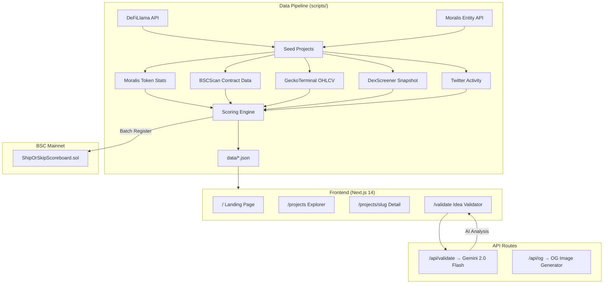
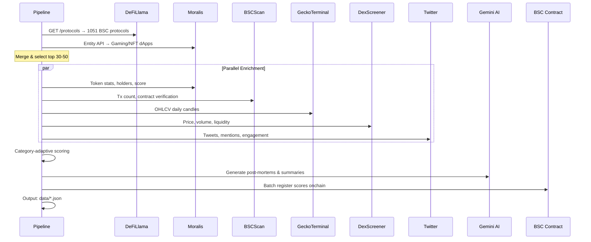
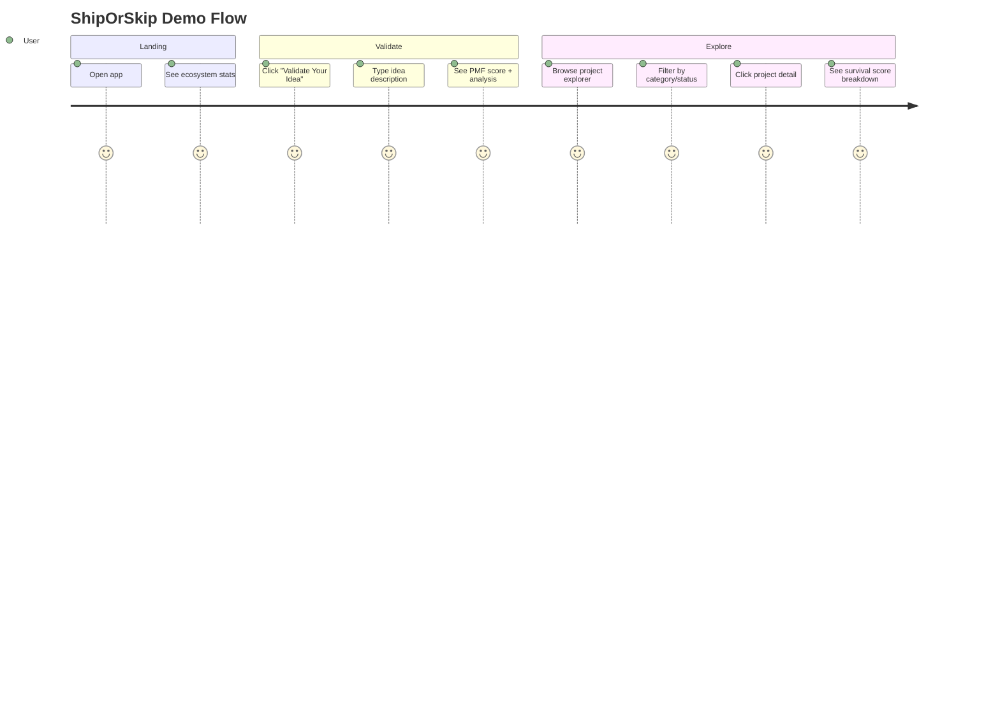

# Technical: Architecture, Setup & Demo

> **ShipOrSkip** — How it works under the hood

---

## 1. Architecture

### System Overview

ShipOrSkip is a **data-first intelligence platform** built with Next.js 14 (App Router). All project data is pre-computed via an automated pipeline and served as static JSON — zero external API calls at runtime (except Idea Validator which calls Gemini).



### Components

| Component | Technology | Role |
|-----------|------------|------|
| **Frontend** | Next.js 14 (App Router), Tailwind CSS v4, TypeScript | 4 pages: Dashboard, Explorer, Detail, Validator |
| **API Routes** | Next.js Server Routes | `/api/validate` (Gemini), `/api/og` (OG images) |
| **Data Pipeline** | TypeScript scripts (10 numbered steps) | Automated data collection from 7 APIs |
| **Scoring Engine** | TypeScript | Category-adaptive survival scoring (0-100) |
| **Smart Contract** | Solidity + Hardhat | Public scoreboard on BSC Mainnet |
| **Charts** | Recharts + TradingView Lightweight Charts | TVL history + token OHLCV candles |

### Data Flow



### On-chain vs Off-chain

| Layer | What | Why |
|-------|------|-----|
| **On-chain** | Survival scores (0-100), idea attestation hashes | Composable data layer — other dApps can read scores |
| **Off-chain** | Full project data, post-mortem reports, charts, AI analysis | Too much data for onchain storage; performance |

### Security

- No user funds at risk (read-only analysis tool)
- Gemini API key server-side only (Vercel env var)
- Smart contract is simple scoreboard (no DeFi risk)
- All external API calls happen in pipeline phase, not at runtime
- Rate limiting built into pipeline (`lib/rate-limiter.ts`)

---

## 2. Setup & Run

### Prerequisites

- **Node.js** 18+ and npm
- **Git**
- API keys (optional — sample data included for demo):
  - Moralis Web3 API (free, 40K CU/day)
  - BSCScan V2 API (free key)
  - Gemini 2.0 Flash API (free, 15 RPM)
  - twitterapi.io API key (for social data)

### Environment Variables

```bash
cp .env.example .env
```

```env
# Required for full pipeline
MORALIS_API_KEY=           # Free at moralis.io
BSCSCAN_API_KEY=           # Free at bscscan.com/apis
GEMINI_API_KEY=            # Free at ai.google.dev
TWITTER_API_KEY=           # twitterapi.io (optional, for social data)
COINGECKO_API_KEY=         # Free demo key (optional fallback)

# Smart Contract
DEPLOYER_PRIVATE_KEY=      # For contract deployment only
BSC_RPC_URL=https://bsc-dataseed.binance.org/

# Frontend
NEXT_PUBLIC_CONTRACT_ADDRESS=  # After deployment
NEXT_PUBLIC_CHAIN_ID=56        # BSC Mainnet
```

### Install & Build

```bash
# Install dependencies
npm install

# Run data pipeline (optional — sample data included)
npm run seed                    # Full pipeline (~15-20 min)
npm run seed:defillama          # Step 1 only: fetch BSC protocols
npm run seed:enrich             # Steps 3-6: enrich from all APIs
npm run seed:analyze            # Steps 8-9: scoring + narrative

# Start development server
npm run dev                     # Opens at http://localhost:3000

# Deploy smart contract (testnet)
npm run contract:deploy         # BSC Testnet
npm run contract:deploy:mainnet # BSC Mainnet (Day 4)

# Run tests
npm run contract:test           # Hardhat tests
```

### Verify

1. **Frontend:** Open `http://localhost:3000` — should see dashboard with ecosystem overview
2. **Data:** Check `data/projects.json` exists and contains 30+ projects with `survivalScore`
3. **Contract:** Check deployed address in `bsc.address` and verify on BSCScan

> **Quick demo without API keys:** The repo includes `data-example/` with sample data. Run `npm run dev` directly — the app will read from sample data.

---

## 3. Demo Guide

### Access

- **Live demo:** See `frontendUrl` in [`bsc.address`](../bsc.address)
- **Local:** `npm install && npm run dev` → `http://localhost:3000`

### User Flow



### Key Actions to Try

1. **Landing Page** — See the dashboard with ecosystem overview. Note the stats bar: "50+ analyzed · 60% dead · AI-powered"
2. **Idea Validator** — Click "Validate Your Idea", type any BNB ecosystem idea:
   - Try: *"I want to build an AI trading bot on BNB"*
   - Try: *"New DEX aggregator with lowest fees"*
   - Try: *"Move-to-earn fitness app on BNB Chain"*
   - Watch the 5-stage loading theater, then see the full PMF report
3. **Explorer** — Click "Explore Projects" → browse all 30-50 analyzed projects
   - Filter by category (DeFi, Gaming, Meme, Infrastructure)
   - Filter by status (Alive, Zombie, Dead)
   - Sort by survival score
4. **Project Detail** — Click any project card to see:
   - Survival score breakdown (each factor scored 0-100)
   - Post-mortem report (for dead/zombie projects)
   - Token price chart (OHLCV candles)
   - Whale conviction signal (if detected)
5. **Onchain Verification** — Check `bsc.address` → click explorer link → verify scores are stored onchain

### Expected Outcomes

| Action | Expected Result |
|--------|----------------|
| Open app | Dashboard loads with project stats, no wallet needed |
| Validate idea | PMF score (0-100) + verdict (SHIP / HIGH_RISK / CAUTION) + analysis |
| Browse explorer | 30-50 project cards with score badges and status indicators |
| View dead project | Post-mortem with root cause, timeline, lessons |
| View alive project | Alive summary with key differentiator, risk factors |
| Check BSCScan | Contract verified, scores stored in mapping |

### Troubleshooting

| Issue | Fix |
|-------|-----|
| No data showing | Run `npm run seed` first, or app will use `data-example/` |
| Validator timeout | Gemini API may be rate-limited; wait 1 minute and retry |
| Charts not loading | Ensure `data/token_charts.json` exists (run `npm run seed:enrich`) |
| Contract not found | Check `bsc.address` for correct address; ensure correct network in wallet |
